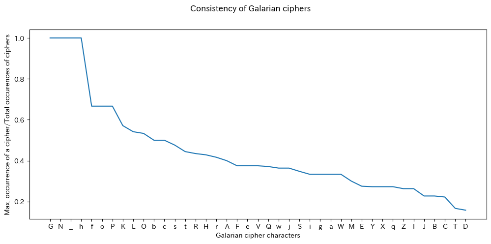

<link rel="stylesheet" type="text/css" media="all" href="./style/style.css">

# Consistency of Galarian Ciphers within Words

The data was taken from [dammyyy's Github page](https://dammyyy.github.io/GalarAlphabet/), although I changed some translations for consistency. For the preprocessing of the data, I only used those (Galarian,Translation) pairs where a translation was given, removed the duplicates, and transcribed dammyyy's notation to Thraex Magnus for an easier understanding here. The graph I attach shows the true/plaintext characters on the X axis and a value on the Y axis that is calculated as the number of times the most common cipher is used divided by the number of times the character is used as a cipher. This means that the closer to 1 (100%) the value is, the more consistent it is. Those values having 0.5 (50%) would mean that half the time, one single cipher is used, while the other 50% of the time, other cipher(s) have been applied. I based this study on the matrix (Table 4.5) on Ferrer i Jané (2022).

As you can see, most ciphers are VERY inconsistent. In the [raw data](../dammyyy_data/galarian_consistency_data.csv), you can see that only **G** and **N** were used more than once, while **_** and **h** may be considered *hapax*, thence their perfect consistency.

The most impactful cases of inconsistency of the Galarian writing is shown in [this document](./TODO-cases-of-inconsistency.md).

## References

Ferrer, J., & Moncunill, N. (2022). Sistemas de escritura paleohispánicos: clasificación, origen y desarrollo. Sinner y Velaza, 97-129.