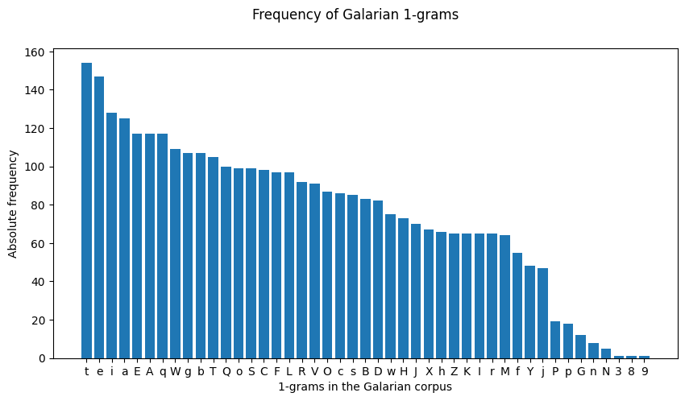
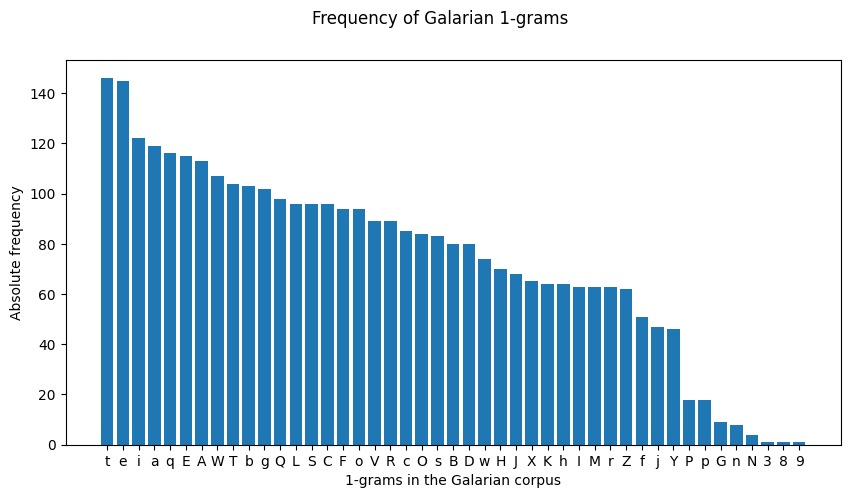
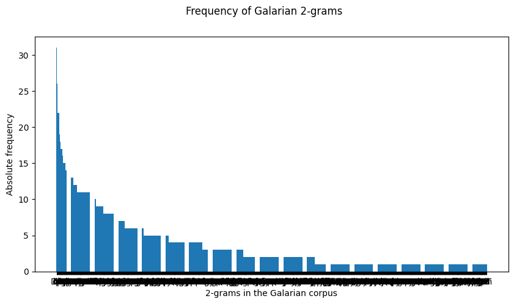
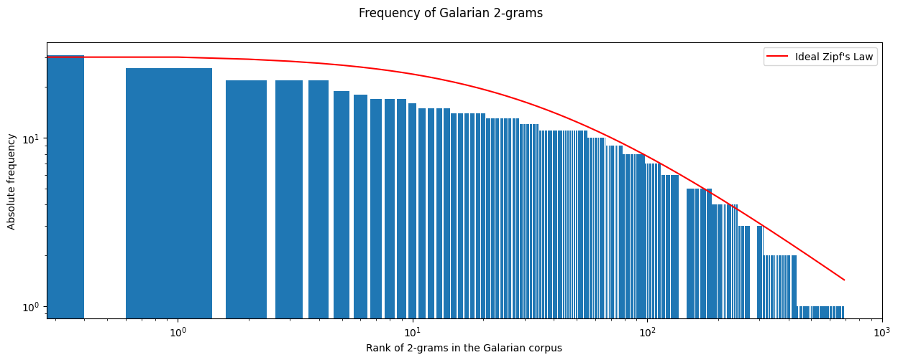
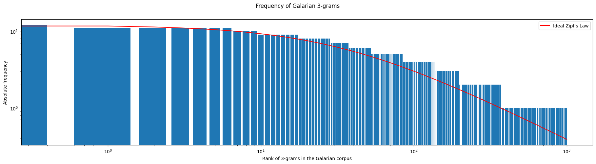

<link rel="stylesheet" type="text/css" media="all" href="./style/style.css">

# Galarian Frequency of n-grams

The frequency analysis of characters within the words found written in the Galarian script may shed a light on our current understanding of the cipher used in these words. First of all, we need to look at individual characters, to know if there is a possibility the cipher is completely random or if there is something remotely similar to a natural language. For that, we will also check a greater number of n-grams, which will show the relation between the characters.

## 1-grams

The frequency of characters in the Galarian corpus show a gradual curve, which allows us to exclude a random cipher; otherwise, it would show a similar frequency for every character. However, some characters, like <thraex>t</thraex> (t), the most common, is about 16 times more frequent than <thraex>N</thraex> (N). The least common one, exluding numbers. Still, there is a strange gap between <thraex>j</thraex> (j) and <thraex>P</thraex> (P), which can be caused by:

1. Garbage text that artificially increase the frequency of some characters.

By removing the duplicates, we can observe whether the frequency of the characters has been altered by repeating garbage text. It doesn't remove meaningless text, but we cannot currently discern whether a word is meaningful semantically. In the figure below, which shows the frequency of n-grams in the Galarian corpus after removing duplicate entries, we can see that some characters have become more common than others, but there is still a great gap between <thraex>Y</thraex> (Y) and <thraex>P</thraex> (P).

## 2-grams

In this case, we already work on a corpus without repeated entries. As we can see in the Figure (in which there are too many 2-grams to see properly along the X axis), the frequency of 2-grams follows an exponential shape.

One can compare the results with the [Zipf's Law](https://en.wikipedia.org/wiki/Zipf%27s_law), an empirical law which states that, when an array of measured values is sorted in descending order, the value of the $n$-th order is usually inversely proportional to $n$. In the following Figure, where the frequencies are represented in log scale against the ideal Zipf's Law, we can see that the Galarian values create a similar curve as the ideal, which may indicate that the texts follow a natural language tendency.

## 3-grams

Performing a third last run on the previous experiment, by changing the size of the n-grams to 3, we can observe that Zipf's Law is more or less being followed here, too.

## Questions

- What does the great gap between 1-grams signify?
- Which implications arise with Zipf's Law?