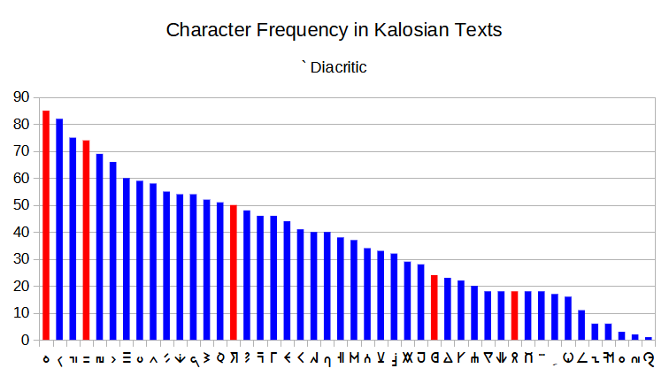
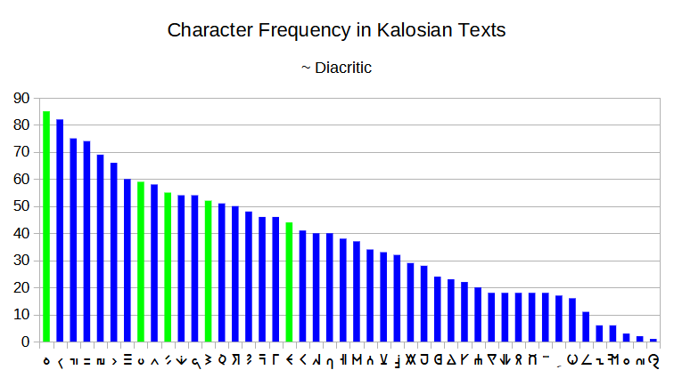

<link rel="stylesheet" type="text/css" media="all" href="./style/style.css">

# Kalosian Diacritics

It is known that the Kalosian version of PokéLatin introduces two new diacritics to the mix. These accent marks are paired only with a select number of characters:

**Diacritic <thraex>~</thraex>**

|Character|Frequency|Frequency w/o diacritic|
|---|---|---|
|<thraex>~s</thraex>|6|55|
|<thraex>~B</thraex>|5|52|
|<thraex>~O</thraex>|3|44|
|<thraex>~q</thraex>|2|85|
|<thraex>~w</thraex>|2|59|

**Diacritic <thraex>`</thraex>**

|Character|Frequency|Frequency w/o diacritic|
|---|---|---|
|<thraex>\`e</thraex>|5|74|
|<thraex>\`q</thraex>|4|85|
|<thraex>\`R</thraex>|4|50|
|<thraex>\`D</thraex>|3|24|
|<thraex>\`P</thraex>|1|18|
|<thraex>\`a</thraex>|1|1|

Given that Kalos is a fictional region based on real-life France, it is possible that the designers at Game Freak added these diacritics as a gesture towards their alphabet, which is notorious by their many accent marks:

- Grave accent (`)
- Accute accent (´)
- Circumflex accent (^)
- Diaeresis (¨)
- Cedilla (ç)

It is not far-fetched, then, to relate the French diacritics to those used in Kalosian. The question lies on which ones match. The boundaries are the vowels (*a*,*e*,*i*,*o*,*u*) and *c* (only for cedilla).

It is unlikely that any of these diacritics represent a cedilla, since that would imply that only 2 characters would be affected: the uppercase and the lowercase. However, as shown in the previous tables, the diacritics affect 5 characters in each case.

Some of the accented letters are considered uppercase since the context in which they appear imply that, except for <thraex>s</thraex> which looks lowercase but shares context with uppercase letters:

> (<thraex>s</thraex>), <thraex>B</thraex>, <thraex>O</thraex>, <thraex>R</thraex>, <thraex>D</thraex>, <thraex>P</thraex>

Unless <thraex>s</thraex> is indeed lowercase, there are more uppercase characters than possible vowels, except for **y**, that we are not counting here since its use of diacritics is scarce in French and non-existent in English. The rest of the letters are considered lowercase:

> <thraex>q</thraex>, <thraex>w</thraex>, <thraex>e</thraex>

Having <thraex>q</thraex> being affected by both diacritics and the most frequent character overall, as shown in Figures 1 and 2, it is probable that the character also represents the most common vowel in both English and French, **e**. However, the commonly accepted translation of <thraex>PQRwNQT DEMLEZ</thraex> as **POKeMON CENTER** implies that <thraex>w</thraex> is the most probable cipher for **e**. This is strange since not only is this the 8th most common cipher character, but also it has only one discovered accent mark. Nevertheless, another text, located in the front of the Museum, <thraex>Mbe~w</thraex>, has been transcribed as **Musé**, from French *musée*, which also transcribes <thraex>w</thraex> as **e** with partial success.

