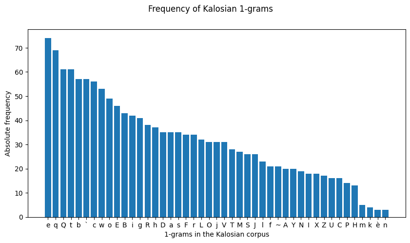
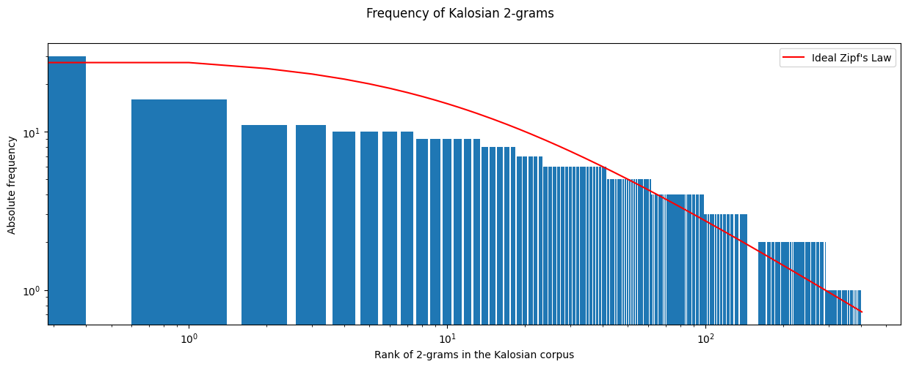
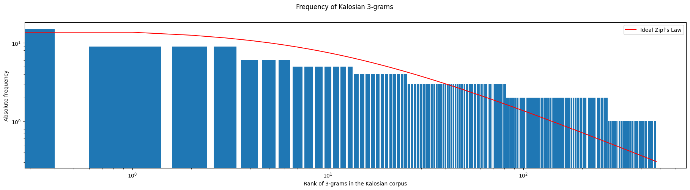

<link rel="stylesheet" type="text/css" media="all" href="./style/style.css">

# Kalosian Frequency of n-grams

This is the same studied that was carried out for [Galarian](./galarian-frequency.md), but applied to the Kalosian script and corpus.

## 1-grams

In this case, there is a less steep curve than in Galarian. Of course, there is less text to work with, since Legends: ZA has not come out yet, but there is about 100 entries in the corpus with varying length to show a tendency. We are counting almost all accented marks separately, except for **è**, which became joint within the corpus due to technicalities.

The main difference with respect to the Galarian results is that the most common character there, <thraex>t</thraex> (t), becomes <thraex>e</thraex> (e), just like the [Paldean's case](./paldean-frequency.md).

## 2-grams and 3-grams

Given the shape of the ideal [Zipf's Law](https://en.wikipedia.org/wiki/Zipf%27s_law) curve, the log-log graphs representing the absolute frequencies of both 2 and 3-grams don't follow it perfectly, as shown in the following Figures, but it is still noticeable how they follow a similar tendency.

