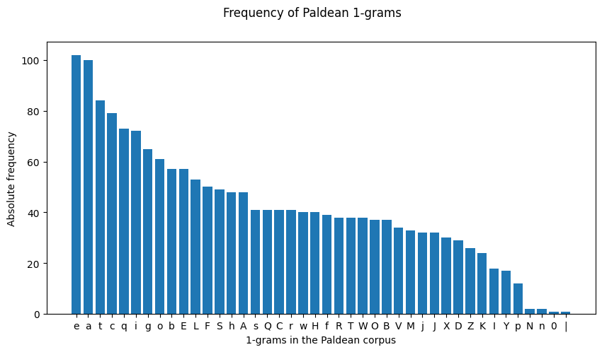
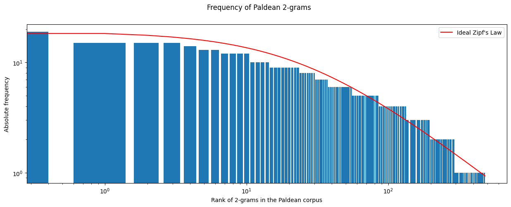
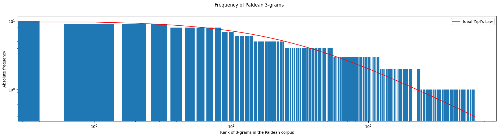

<link rel="stylesheet" type="text/css" media="all" href="./style/style.css">

# Paldean Frequency of n-grams

This is the same studied that was carried out for [Galarian](./galarian-frequency.md), but applied to the Paldean script and corpus.

## 1-grams

The curve that is created by the frequency of the characters is unlike the Galarian and [Kalosian](./kalosian-frequency.md) results. In this case, the shape is exponential for the first most common half of the character set, which then resembles a logarithmic function. Paldean has around text 150 entries.

## 2-grams and 3-grams

Given the shape of the ideal [Zipf's Law](https://en.wikipedia.org/wiki/Zipf%27s_law) curve, the log-log graphs representing the absolute frequencies of both 2 and 3-grams follow it to some extent, as shown in the following Figures, similarly to Galarian and Kalosian. The tendency is the same: the n-grams do not follow Zipf's Law perfectly, but have a similar shape.

